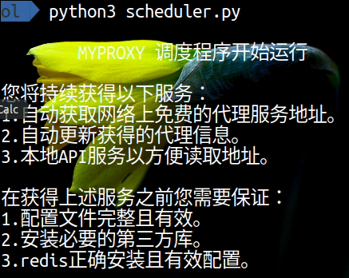
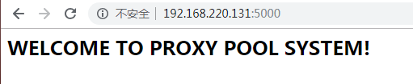
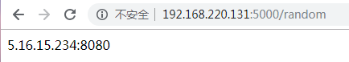
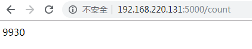

#MYPROXY代理池

###1.运行环境
Winodows/Unix/Linux系列  
Python3.5+

###2.安装

+ Python第三方库安装：pip(3) install -r requirements.txt
+ Redis安装参考链接：http://www.runoob.com/redis/redis-install.html

###3.环境配置
+ 如需更改配置文件，请按照文字描述准备更改
+ 保证Redis正常运行，如与程序不在同一主机，请保证Redis支持远程连接且程序配置文件正确配置

###4.关于运行
+ 程序运行入口为scheduler.py，启动方式如下：  

+ 调度程序会自动启动代理获取、代理验证、WebAPI服务，通过以下方式可以查看API是否正常运行：  

+ 如果获取代理直接访问接口即可：  

+ 如需要查看代理池中现存的代理数量，需要访问以下地址：  

###5.关于拓展
+ 可以通过在crawler.py中添加crawl\_*方法(需要以crawl\_开头)来对爬虫页面进行拓展  
+ 通过配置文件可以修改代理池的容量，以及代理检测时的分数设定
+ 可以通过更改server.py内容，实现WebAPI的功能定制化

###6.参考资料
https://github.com/Python3WebSpider/ProxyPool